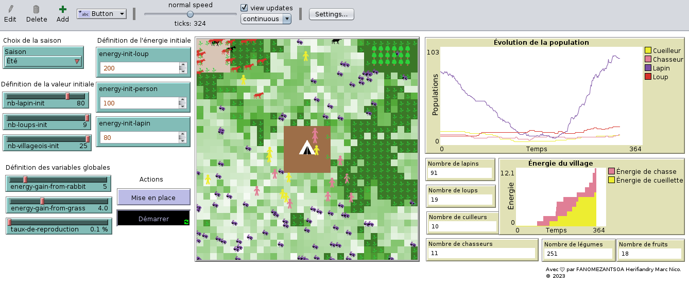

## Les chasseurs-cueilleurs

Ce modèle vise à étudier la stabilité des écosystèmes prédateurs-proies en tenant compte des interactions entre les humains, les loups et les lapins à l'aide de NetLogo.

## Auteur

FANOMEZANTSOA Herifiandry Marc Nico

## Comment ça fonctionne

Voici comment fonctionne ce modèle :

- Les loups mangent des humains et des lapins.
- Les humains mangent des fruits et des légumes.
- Les humains peuvent tuer les loups si leur énergie est supérieure à celle du loup.
- Les lapins mangent des légumes.

## Comment l'utiliser

Voici comment vous pouvez l'utiliser :

- Vous pouvez ajuster les paramètres en fonction de la simulation que vous souhaitez.
- Observez l'évolution de la population dans le graphique.
- Consultez l'état de l'énergie du village.
- Visualisez les nombres et l'état des agents pendant l'exécution de la simulation.

## Points à remarquer

- Si tous les humains meurent, la simulation s'arrête.

- Le taux de reproduction varie entre 0,1 et 1,0. Si le taux est de 0,1, cela signifie que les agents vont se reproduire beaucoup. Si le taux est de 1,0, le taux de reproduction sera faible, à l'inverse. (Faites attention)

## Ce que vous pouvez essayer

Voici ce que vous pouvez essayer :

- Changer la saison dans la SELECT.
- Définir les valeurs initiales des agents loups à l'aide des SLIDER.
- Définir l'énergie initiale des loups à l'aide des TEXT INPUT.
- Définir les variables globales à l'aide des SLIDER.
- Appuyer sur le boutons **'Mise en place'** pour configurer l'environnement avant d'appuyer sur le bouton **'Démarrer'**.

## Screenshot

_With_ 🧡 _by **FANOMEZANTSOA Herifiandry Marc Nico**_
